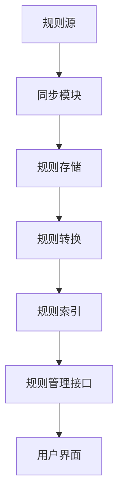

# RuleHub

RuleHub是一个网络安全检测规则仓库系统，用于统一管理、转换和索引来自多个开源社区的安全检测规则。

## 项目架构图



## 快速入门指南

1. 安装依赖：`pip install -r requirements.txt`
2. 配置规则源：编辑`config/sources.yml`
3. 同步规则：`python3 rulehub.py repo sync`
4. 生成索引：`python3 rulehub.py index generate`
5. 启动服务：`python3 rulehub.py`

## 主要功能示例

### 同步规则
```bash
python3 -m tools.sync.sync_manager --repo sigma --branch main
```

### 搜索规则
```bash
python3 -m tools.cli.search --query "suspicious process"
```

### 验证规则
```bash
python3 -m tools.validation.validator --rule rules/sigma/00b90cc1-17ec-402c-96ad-3a8117d7a582.json
```

## 功能特点

- 自动同步多个开源规则仓库
- 规则格式转换和标准化
- 规则索引和搜索
- 统一的规则管理接口

## 关键模块说明

### 同步模块 (tools/sync/sync_manager.py)
```python
def sync_repository(repo_config):
    """
    同步指定规则仓库
    
    参数:
        repo_config (dict): 仓库配置信息
        
    返回值:
        dict: 同步结果统计信息
        
    异常:
        SyncError: 同步过程中发生的错误
    """
    ...
```

### 索引模块 (tools/indexing/indexer.py)
```python
def build_index(rule_dir, index_file):
    """
    构建规则索引
    
    参数:
        rule_dir (str): 规则目录路径
        index_file (str): 索引文件输出路径
        
    返回值:
        int: 索引的规则数量
    """
    ...
```

## 目录结构

```
RuleHub/
├── .github/            # GitHub工作流配置
│   └── workflows/      # CI/CD工作流
├── config/             # 配置文件目录
│   └── sources.yml     # 规则源配置
├── docs/               # 文档目录
│   ├── api_reference.md
│   ├── cli_usage.md
│   ├── contributing.md
│   ├── developer_guide.md
│   ├── rule_format.md
│   ├── usage.md
│   └── user_guide.md
├── examples/           # 示例规则
│   ├── custom/
│   ├── elastic/
│   ├── sigma/
│   └── splunk/
├── index/              # 索引文件
│   ├── custom_index.json      # 自定义规则的索引
│   ├── elastic_index.json     # Elastic规则的索引
│   ├── index_stats.json      # 索引统计信息
│   ├── mitre_index.json      # MITRE ATT&CK框架映射索引
│   ├── other_index.json      # 其他来源规则的索引
│   ├── rules_index.json      # 所有规则的全局索引
│   ├── rules_index_compact.json  # 压缩版全局索引
│   ├── sigma_index.json      # Sigma规则的索引
│   ├── splunk_index.json     # Splunk规则的索引
│   └── tags_index.json       # 规则标签索引
├── rules/              # 规则存储目录
│   ├── custom/         # 自定义规则
│   ├── elastic/        # Elastic规则
│   ├── other/          # 其他来源规则
│   └── sigma/          # Sigma规则
├── stats/              # 统计信息
│   └── sync_stats.json
├── tests/              # 测试目录
│   ├── fixtures/       # 测试数据
│   ├── test_cli.py     # CLI测试
│   ├── test_indexing.py # 索引测试
│   ├── test_sync.py    # 同步测试
│   └── test_validation.py # 验证测试
├── tools/              # 工具脚本目录
│   ├── cli/            # 命令行接口
│   ├── indexing/       # 索引工具
│   ├── sync/           # 同步工具
│   ├── utils/          # 通用工具类
│   └── validation/     # 验证工具
├── versions/          # 版本信息
│   ├── latest.json
│   └── v2.0.0.json
├── CHANGELOG.md       # 变更日志
├── CODEOWNERS         # 代码所有者
├── Dockerfile         # Docker配置
├── README.md          # 项目说明
├── debug_sync.py      # 调试脚本
├── docker-compose.yml # Docker Compose配置
├── requirements.txt   # Python依赖
└── rulehub.py         # 主入口脚本
```

## 安装依赖

```bash
pip install -r requirements.txt
```

## 使用方法

RuleHub 提供了统一的命令行接口 `rulehub.py`，支持以下主要功能：

### 规则管理
```bash
# 列出所有规则
python3 rulehub.py rule list

# 显示特定规则详情
python3 rulehub.py rule show --id RULE_ID

# 创建新规则
python3 rulehub.py rule create

# 验证规则
python3 rulehub.py rule validate --id RULE_ID

# 测试规则
python3 rulehub.py rule test --id RULE_ID --sample sample_data.json

# 更新规则
python3 rulehub.py rule update --id RULE_ID --name "新规则名称"

# 删除规则
python3 rulehub.py rule delete --id RULE_ID
```

### 仓库管理
```bash
# 列出所有规则源
python3 rulehub.py repo list

# 同步规则源
python3 rulehub.py repo sync --source SOURCE_NAME

# 添加新规则源
python3 rulehub.py repo add --name "新规则源" --url REPO_URL

# 更新规则源配置
python3 rulehub.py repo update --name SOURCE_NAME --branch new_branch

# 删除规则源
python3 rulehub.py repo remove --name SOURCE_NAME
```

### 索引管理
```bash
# 生成规则索引
python3 rulehub.py index generate

# 搜索规则
python3 rulehub.py index search --tags windows,lateral_movement

# 显示规则统计
python3 rulehub.py index stats
```

### 版本管理
```bash
# 列出所有版本
python3 rulehub.py version list

# 创建新版本
python3 rulehub.py version create

# 查看版本变更
python3 rulehub.py version changelog
```

获取完整帮助信息：
```bash
python3 rulehub.py --help
```

## 配置说明

在`config/sources.yml`中配置规则源信息，包括仓库URL、分支、规则目录路径等。

## 开发环境

- Python 3.8+
- PyYAML
- GitPython
- JSON Schema